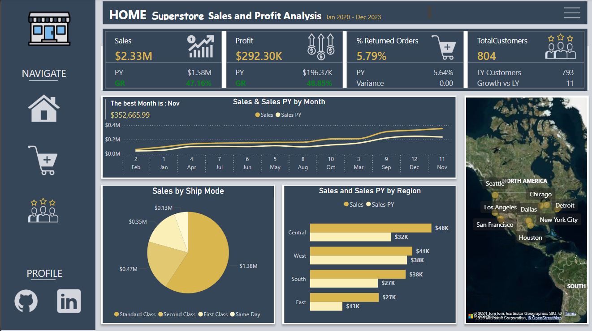

# Superstore-Sales-and-Profit-Analysis
This project involves building interactive dashboards using Power BI to analyze sales, profit, and order data for a superstore from 2020 to 2023. The dashboards provide key insights into customer behavior, sales trends, and performance metrics across categories, regions, and time periods, helping decision-makers optimize their strategies.

# Superstore Sales and Profit Analysis

# Overview
This project focuses on analyzing sales, profit, and order data for a superstore using interactive dashboards. The project aims to provide insights into customer behavior, sales trends, and performance metrics across different categories, regions, and time periods.

# Technologies Used:
Tools: Power BI (Data Visualization)
Languages: DAX, SQL (for data preparation and calculations)
1. Customer Dashboard
The Customer Dashboard provides an overview of sales, profit, and order data for all customers.

# Key Features:

# Sales Metrics:
Total Sales: $2.33M
Total Profit: $292.3K
Total Orders: 5111

# Visualizations:
Sales by Month (Line Chart):
Displays a declining trend in sales over the year, starting from $0.35M in November and decreasing to $0.06M in February.
Sales by Category (Pie Chart):
Breakdown of sales across categories:
Technology: $839.89K
Furniture: $754.75K
Office Supplies: $731.89K
Data Table:
A detailed table showing:

Product names
Order dates
Order IDs
Sales and profit for each product

# 2. Home Dashboard
The Home Dashboard provides a summary of overall sales and profit performance, comparing it to the previous year (PY).

# Key Features:
Performance Metrics:

Total Sales: $2.33M (Growth Rate: 47.16% compared to last year)
Total Profit: $292.30K (Growth Rate: 48.05%)
% Returned Orders: 5.79%
Total Customers: 804

# Visualizations:

Sales and Sales PY by Month (Line Chart): 

Highlights monthly sales trends compared to the previous year, showing strong performance in November ($352.66K).

Sales by Ship Mode (Pie Chart):

Breakdown of sales by shipping modes:

Standard Class: $1.38M

Second Class: $0.47M

First Class: $0.35M

Same Day: $0.13M

Sales by Region (Bar Chart):

Displays sales performance in four regions (Central, West, South, East), with the highest sales in the Central region ($48K).
Interactive Map:
Shows key cities like Los Angeles, San Francisco, and Dallas contributing to sales.

3. Order Dashboard
The Order Dashboard focuses on detailed analysis of orders, discounts, and fulfillment time.

Key Features:
Order Metrics:

Total Orders: 5111
Average Order Value: $455.20
Orders with Discounts: 3004 (58.78%)
Average Fulfillment Time: 3.96 days
Visualizations:

Orders by Month (Line Chart):
Highlights seasonal trends, with a peak in December (738 orders) and significant activity in Los Angeles.
Orders by Segment (Pie Chart):
Segmentation of orders:
Consumer: 51.8%
Corporate: 30.31%
Home Office: 17.88%
Total Orders and Discounts by Region (Bar Chart):
West region leads with 1657 orders and 990 discounts, followed by East, Central, and South.
Top 10 Products by Orders (Bar Chart):
The most ordered products include:
Staples (50 orders)
Staple envelope (48 orders)
Easy-staple paper (46 orders)
How to Use
Open the Power BI file to explore the dashboards interactively.
Use the filters and slicers to analyze data by specific categories, regions, or time periods.
Conclusion
This project provides valuable insights into sales, profit, and order performance for the superstore. The interactive dashboards empower decision-makers to identify trends, evaluate performance, and optimize strategies.

